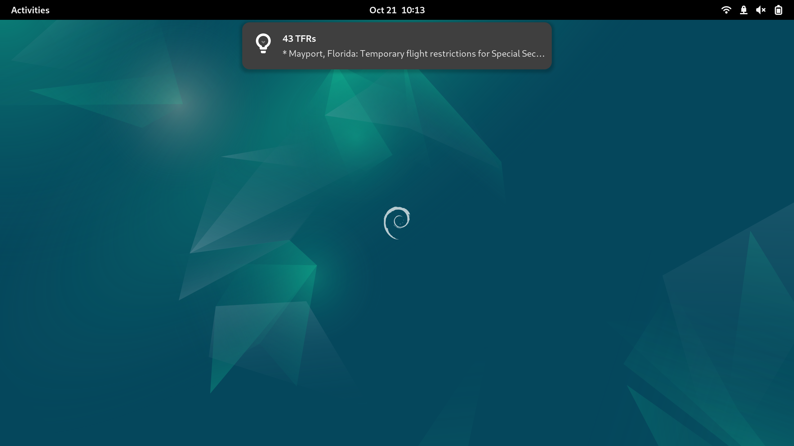

## TFRAlert
Collect and filter TFRs/NOTAMs. Is it a good time to be out flying drones? Let's find out.

- TFRs/NOTAMs that restrict flights under 400ft AGL with specific keyword filtering
- Details of matching results are saved to a json file
- (Soon) periodic list refresh

### Things to know
- **Toy project**: This is an educational project and should not replace the due diligence practices of anyone actually operating any aircraft! See LICENSE.md.
- **Privacy note**: Makes periodic web requests to `tfr.faa.gov`. Use from behind a VPN or proxy or from a public WIFI network if that's a concern.
- **The vibes the vibes the vibes**: Heavily AI-assisted code generation.
- **Best effort**: Data as fresh as `tfr.faa.gov` provides it. For a complete list of all TFRs by category, see the FAA's [JSON feed](https://tfr.faa.gov/tfrapi/exportTfrList).

### Installation
Installation via prebuilt desktop binaries will be supported for windows, mac(silicon and intel), and linux.

Build from source: See Development below for setup instructions. Install desired toolchain target, per Makefile, then run `make build-$TARGET`.

### Development
Clone repo. Install Rust toolchain and the stable version of [Dioxus](https://dioxuslabs.com/), 0.6.3, via `cargo binstall dioxus-cli`.

`dx serve --platform desktop` will show a localhost browser-based version of the application. `cargo run` will run the application on your current platform.

### Signing and notarizing macOS builds: TODO
